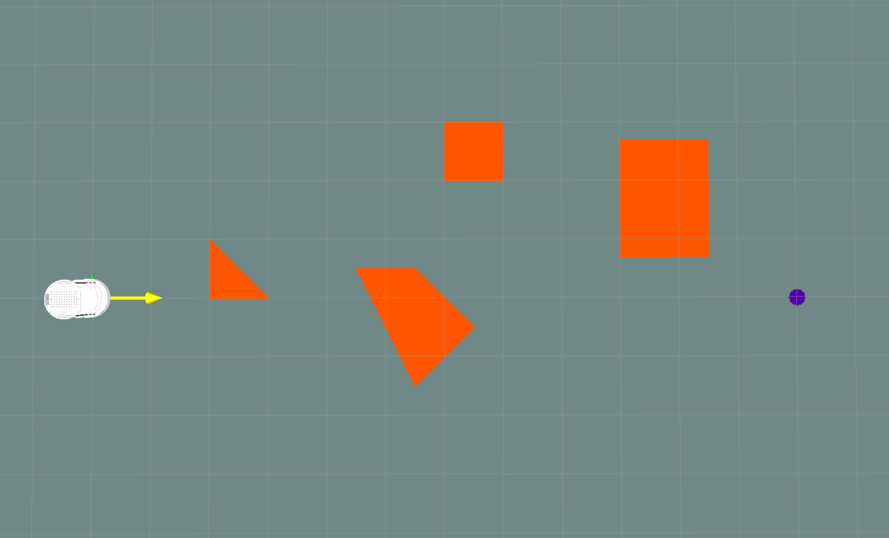
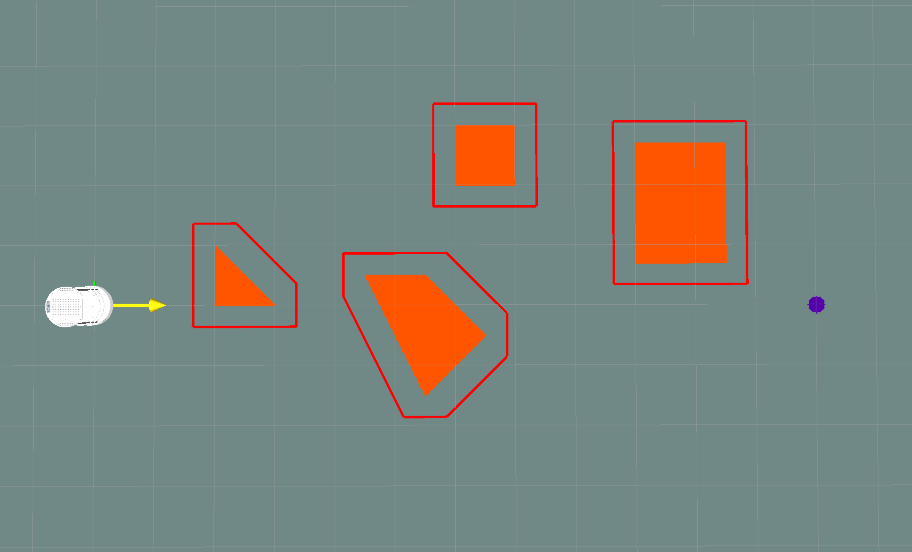
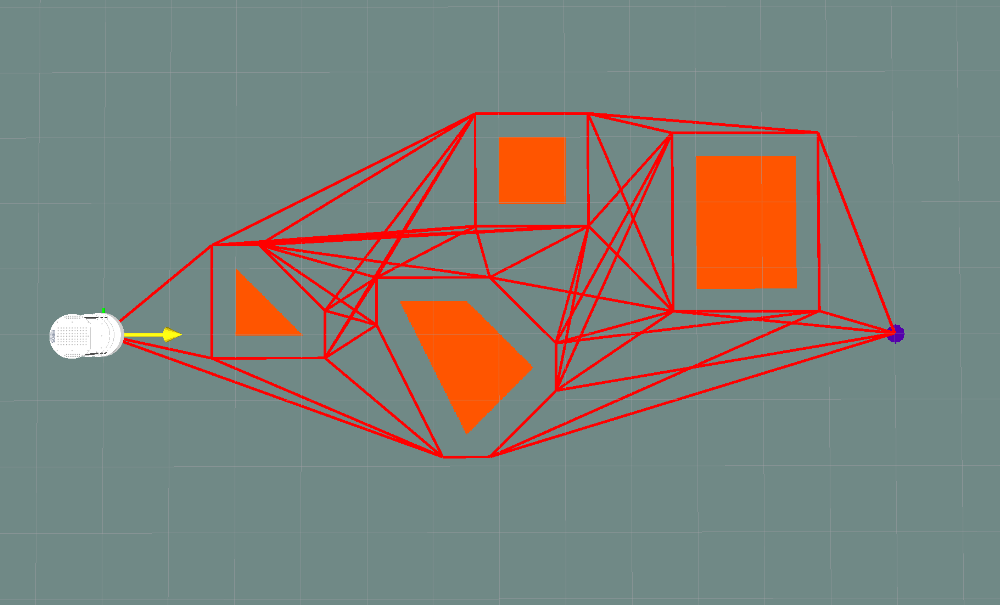
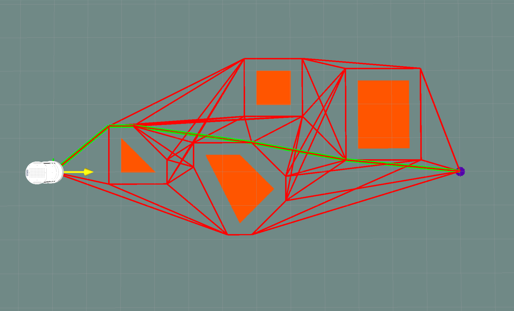

# Lab 3 - Visibility Graph Path Planning
Lab 3 for COMSW4733 Computational Aspects of Robotics at Columbia University (Instructor: Prof. Peter Allen).

## Introduction
In this lab, you are required to implement visibility graph path planning algorithm using the Arbotix simulator and visualize the graph and robot path following in RViz.

## Usage
This repo is a ROS package that you can add to your own catkin workspace to create a map with obstacles (map.png + map.yaml) and load it in RViz. It allows you to custom your map with any shape of polygon obstacles.

## Rubric and Expected Results
We expect to see the following results in your demo video and from running your programs.

- Be able to bring up Arbotix turtlebot simulator and RViz with a map of obstacles (**20 points**)

  

- Grow the obstacles using reflection algorithm (flip the robot around the origin, place it at each vertex of the obstacle, and create a convex hull). You can assume the robot to be a 36cm-by-36cm square. You can pick the reference point anyware on this square. The foolowing example picks the center as reference point. (**20 points**)

  

- Create the vgraph by first fully collecting all obstacle vertices + start + goal and then implement your own collision checker to remove edges that collides with obstacles (except endpoints). (**20 points**)

  

- Implement your own shortest path finding algorithm to find a shortest path from start to goal. (**20 points**)

  

- Modify your robot constroller from Lab 1 and 2 to make the robot follow the path. (**20 points**)

  

